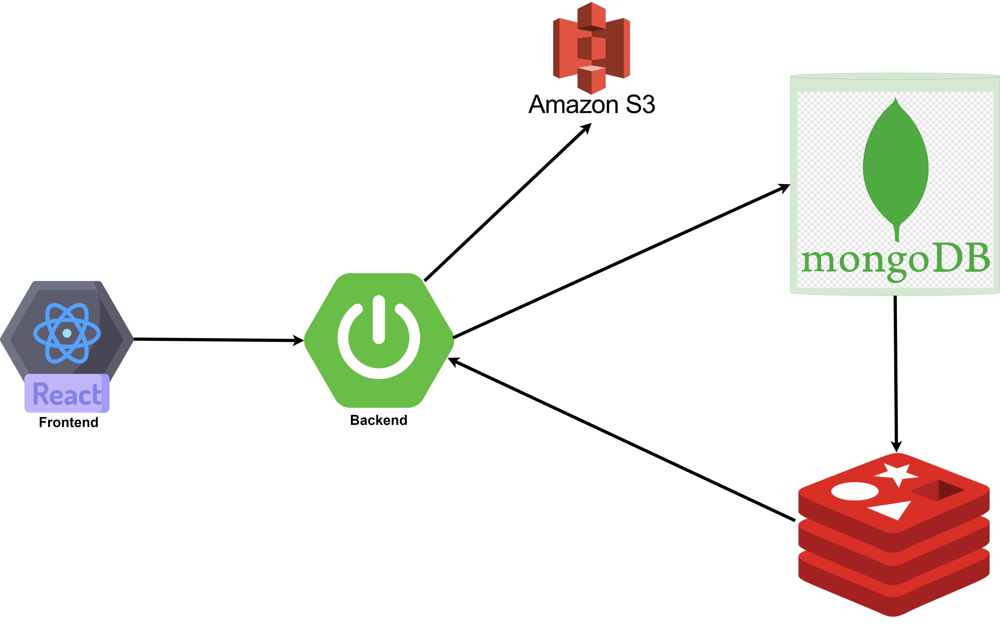
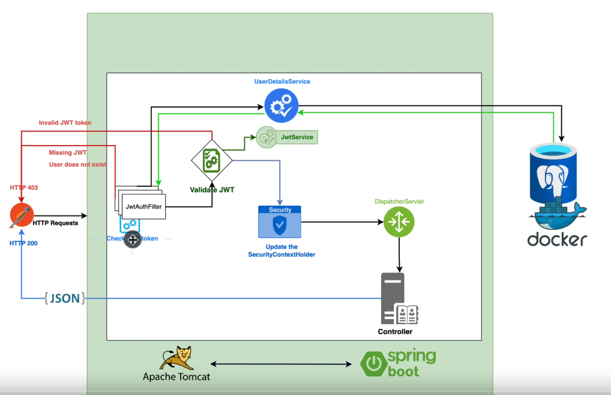
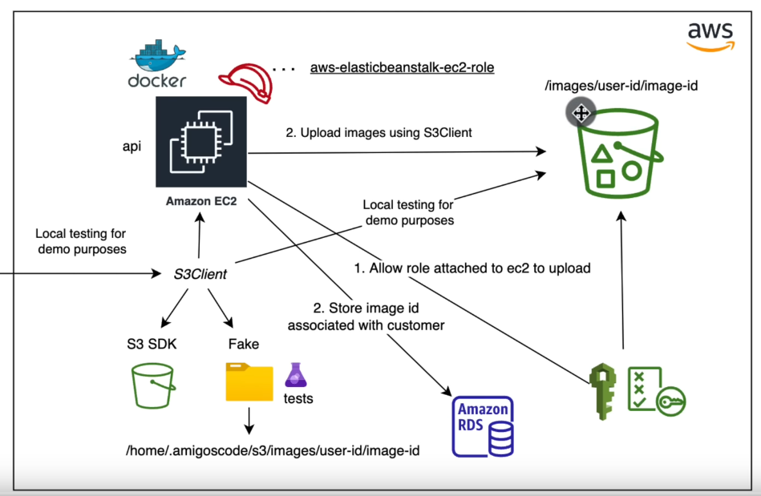
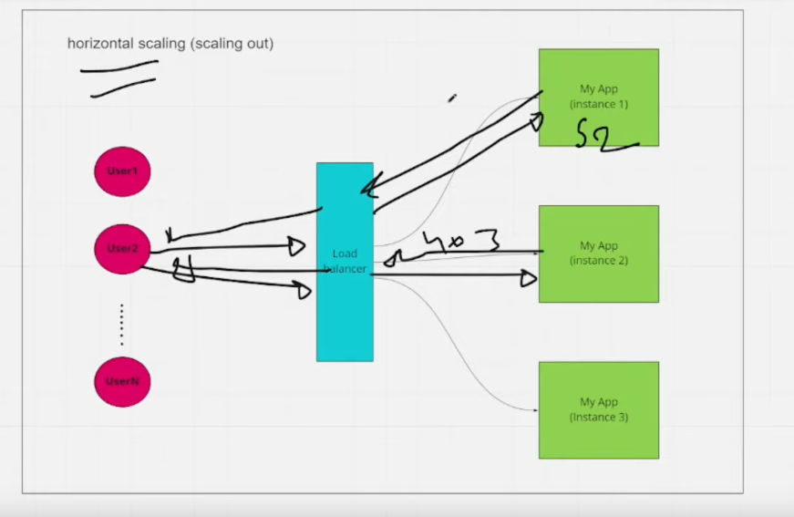
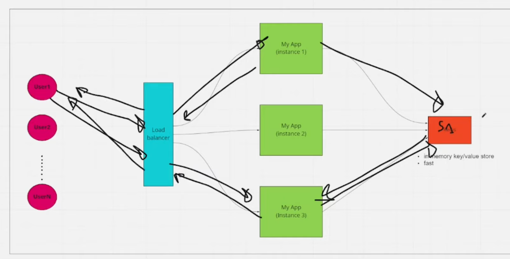

# Student Management System

This web application is developed using Spring Boot and React, allowing you to register, log in to the system, create students, and manage their information, including images and details.

## Features

- User authentication and authorization
- CRUD operations for student information
- Adding images to Amazon S3 bucket
- Storing data in Redis cache

## Shortcuts

### Docker | JWT

### AWS S3

### Redis

## Used Technologies

- Spring Boot
- React
- Spring Security
- Spring Data JPA
- Mapstruct
- Docker
- MongoDB
- Redis
- AWS S3

## Getting Started:

- `docker compose up`
- `mvn spring-boot:run`
- `npm run dev`
